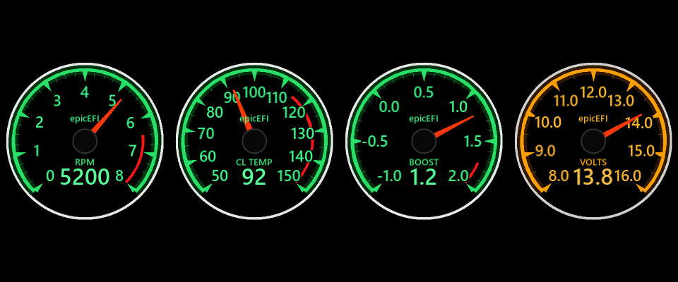

# USB rectangle screen gauge

A gauge drawn **from scratch into an RGB565 framebuffer** — no LVGL, no
graphics library, about 600 lines of drawing code — driving a **VoCore USB2.0
Screen** from a Windows console app at ~24 fps.


---

## Status

| | |
|---|---|
| Panel | VoCore USB2.0 Screen, `0xc872:0x1004`, 480×800 portrait behind a case |
| Link | USB high speed, vendor bulk protocol, ~18 MB/s, one bulk transfer per frame |
| Frame rate | **~24 fps** (the read-out on the dial shows the delivered rate) |
| App | Windows console program, ~770 KB, gcc + libusb loaded at runtime |
| Tests | 103 unit tests + 33 contract checks, all passing |
| Graphics | none — a framebuffer and hand-written primitives |

The dial is a tachometer with a boot self-test sweep and an engine simulator.
Temperature, boost and battery presets are switchable at runtime from the
console (and from a tap on the panel, if the glass has touch — see the note in
[`docs/usb-screen.md`](docs/usb-screen.md)).

## Quick start

```powershell
tools\build.ps1                  # gcc; copies a libusb DLL next to the exe
build\gauge.exe                  # the gauge, then a REPL on stdin
```

The console comes up **before** the screen is touched, so a missing panel can
never lock you out; `connect` looks for it again.

```
gauge> gauge temp        switch instrument
gauge> value 4200        drive the needle (stops the simulator)
gauge> test fill         a solid white screen: panel fault or drawing fault?
gauge> fps               delivered frame rate + render/flush split
gauge> info              panel, geometry, USB, framebuffer
```

`--size WxH`, `--brightness N`, `--value N`, `--gauge ID`, `--test NAME`,
`--render FILE` and `--run SECONDS` cover the non-interactive cases; `--help`
lists them all.

Requirements: an MSYS2/mingw-w64 gcc, and a `libusb-1.0.dll` (the build script
finds the one from `pip install libusb-package`, MSYS2's, or
`%GAUGE_LIBUSB_DLL%`).  The screen must be bound to WinUSB — the VoCore
"USB2.0 Screen driver" package does that.

## The panel, and the traps in it

The screen is a vendor-specific USB device: a bulk OUT endpoint takes whole
frames, an interrupt IN endpoint reports touch, and vendor control requests
drive it.  All of that, and the two things that cost the most time, are in
[`docs/usb-screen.md`](docs/usb-screen.md).  The short version:

* it reports **no model** — the identification registers read all ones — so the
  geometry (480×800, RGB565, no margin) was measured with markers, colour bands
  and a hue ramp;
* it **accepts partial-rectangle writes and ignores them**, but still moves its
  frame pointer by the size of the rectangle.  The next whole frame is then
  circularly shifted by that many pixels, which is what makes a dial arrive as
  two half-dials on opposite sides.  The app therefore sends whole frames only
  (`--partial on` is opt-in and it is the cause, not the cure), and a session
  that inherits a shifted panel can pre-roll with `--xshift N` or clear it with
  a power cycle;
* the SDK's **flip command changes the display's addressing** on this unit and
  none of its four modes reproduces the power-on state, so the app never sends
  it unless asked.

## Why there is no LVGL

An earlier version of this project used LVGL 9.6.  It worked, but the panel
only ever painted part of the dial — whole sectors stayed black, or went black
a fraction of a second after being drawn correctly.

A solid white fill drawn straight into a framebuffer fills the panel edge to
edge and rock steady.  That was the whole answer: **the fault was LVGL's
partial-flush path**, not the panel, the wiring or the power.  Dropping it made
the program 61 % smaller (869 KB → 337 KB) and the display perfect.

Everything here is plain C on one framebuffer.  A contract check fails if a
graphics library creeps back in.

## Layout

```
src/         the whole program
  main.c            options, startup order, the frame loop
  app_console.c     the REPL on stdin
  app_gauge.c       the gauge driver, the demo script, the frame stats
  app_tests.c       bring-up test screens
  app_bsp.c         the panel API gfx draws through (framebuffer -> USB)
  app_time.c        a monotonic clock and a sleep
  usb_libusb.c      libusb-1.0.dll, loaded at runtime
  vocore_proto.c    the screen's wire protocol, pure data
  vocore_panel.c    identify, wake, whole frames, the column offset, touch
  gfx.c gfx_text.c  framebuffer and drawing primitives, generated bitmap fonts
  gauge_*.c         gauge maths / theme / presets / renderer, pure C
include/     the headers for the above
tests/
  unit/      C tests, run on the desktop against a stubbed panel
  contracts/ Python checks on the generated artefacts and the docs
tools/
  build.ps1            build the app (gcc, -DGFX_W=480 -DGFX_H=800)
  test.ps1             run every suite
  usb_screen.py        identify / paint / watch touch on the screen
  render_preview.py    host-rendered dial mock-ups
  render_usb_preview.py  the four dials through the real renderer at 480x800
  gen_font.py          rasterise the fonts -> src/gfx_font_data.c
docs/
  usb-screen.md    what the screen is, the protocol, the traps
  development.md   toolchain, build, tests, design notes
```

## Console

| Command | What it does |
|---|---|
| `help` | List commands |
| `gauge` | List instruments; `gauge temp` switches |
| `demo on\|off\|sweep` | Engine simulator, or replay the self-test sweep |
| `value 4200` | Drive the needle directly (stops the simulator) |
| `fps` | Delivered frame rate + render/flush split; `fps off` hides the readout |
| `backlight 0-100` | Backlight duty |
| `partial on\|off` | Partial-rectangle writes (leave off on this panel) |
| `xshift 240` | Panel column offset (see docs/usb-screen.md) |
| `test fill\|bars\|grid\|circle\|quad` | Bring-up test screens |
| `next` / `resume` | Cycle test screens / back to the gauge |
| `flush` | Panel transfer statistics |
| `touch` | Touch state |
| `info` | Panel, USB and framebuffer |
| `connect` | (Re)open the screen |
| `version` | Build information |

`test fill` is the one worth remembering: a solid white screen is the fastest
way to tell a panel problem from a drawing problem. The frame-rate readout is
also drawn on the dial itself, under the numeric value.

## Tests

```powershell
tools\test.ps1                          # unit tests + contract checks, ~2 s
tools\test.ps1 -Filter render           # one suite
python tests\contracts\test_contracts.py
```

`gfx` talks to the panel through exactly one function, so **the framebuffer and
the whole gauge renderer are tested on the desktop** with the panel stubbed
out — and so is the screen's protocol, against a fake transport that records
the conversation byte for byte.  That is where the bugs get caught: the tests
found a real one where every glyph was drawn one ascent too low, which on the
panel showed up as the bottom of the "6" disappearing into the green band
behind it.

See [`tests/README.md`](tests/README.md).

## Adding a gauge

Everything that distinguishes one instrument from another lives in
`gauge_config_t`. Add a preset in [`src/gauge_presets.c`](src/gauge_presets.c):

```c
static const gauge_config_t s_oil_temp = {
    .caption         = "OIL TEMP",
    .wordmark        = "epicEFI",
    .min             = 40.0f,
    .max             = 160.0f,
    .major_step      = 20.0f,
    .minor_per_major = 4,
    .alarm_from      = 130.0f,     /* warning band start; > max for none  */
    .decimals        = 0,
    .slew_time       = 2.5f,       /* slow, damped movement               */
    .theme           = &gauge_theme_greddy,
};
```

Register it in `s_presets[]` and it appears in the `gauge` console command.
`tools\test.ps1` then picks it up automatically: the preset tests build a dial
for every entry and check the geometry is self-consistent.

To see it before running, add the same preset to `tools/render_preview.py` and
run it — a contract check fails if the two lists drift apart.
`gauge.exe --render frame.raw --gauge rpm --value 5200` draws the real C
renderer's output instead, and `tools/render_usb_preview.py` turns those into
PNGs.

## Visual design

The dial is a homage to the classic 1990s Japanese instrument look, with the
details that make it read as one:

| Feature | How it is done |
|---|---|
| Green rail | a continuous arc at the outer edge, never interrupted |
| Warning sector | a **separate arc set inboard of the ticks**, not a recolour of them |
| Major ticks | **wedges pointing at the centre**, flat edge on the rail |
| Minor ticks | thin radial lines |
| Numerals | generated bitmap font, centred on cap height |
| Needle | tapered polygon rotated about the dial centre, with a counterweight tail |
| Branding | `epicEFI` above the hub |

The dial is a 448 px circle on the 480×800 glass, with the theme's pixel
lengths scaled by `geometry_scale` and the fonts drawn at `text_scale` 2 — the
layout is explicit in `gauge_config_t`, so a theme does not care what it lands
on.  The geometry defaults to a 240 px dial on a 320×240 panel, which is what
the theme values were drawn for.

`tools/render_preview.py` renders every preset on the host so the design can be
reviewed without hardware — the four instruments side by side:


`tools/render_usb_preview.py` does the same through the **real C renderer** at
the panel's geometry (480×800, 448 px dials):



## Roadmap

- [x] No-graphics-library renderer, host-tested
- [x] Gauge maths, themes, presets, bitmap fonts
- [x] The VoCore screen: protocol, geometry, the partial-write trap
- [ ] Real data: CAN / OBD-II / analogue inputs
- [ ] Use the tall panel's spare height for a digital read-out / warning strip
- [ ] Compressed whole frames (the protocol has LZ4/JPEG; the wire is the limit)
- [ ] Persist gauge selection in a config file
